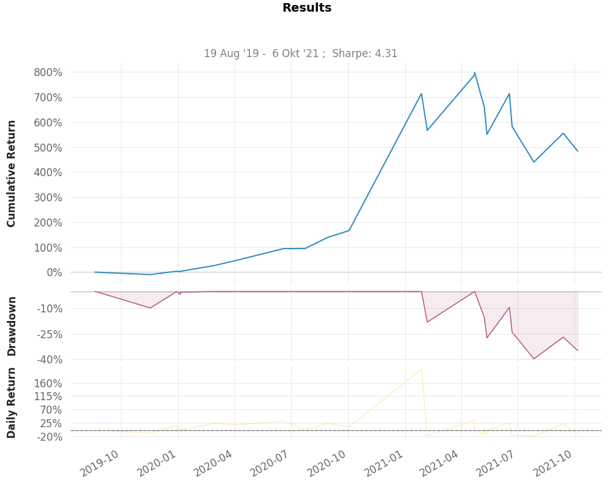

**DEPRECATED**

# Backtra

Backtra is an advanced futures backtesting framework where we loop through kline (ohlcv) data on a specific way to acheive more realistic results.

This is a futures backtesting framework but it can also be used for spot backtesting.

**More in-depth documentation is coming soon!**

## Getting Started

### Install
```
git clone https://github.com/AlgoQ/backtra
cd backtra
pip install -r requirements
```

We will be backtesting a simple golden cross strategy with a stoploss and take profit based on the ATR. The leverage is also based on the ATR and the max percentage you are willing to lose per trade.

:max_bytes(150000):strip_icc():format(webp)/GoldenCross-5c6592b646e0fb0001a91e29.png)

1. **Config**

Rename the `exampleConfig.json` file to `config.json` and update the parameters if wanted.

```json
{
    "capital": 10000,
    "makerFee": -0.0025,
    "takerFee": 0.0075,
    "reduceAmount": 0
}
```


2. **Strategy**

Create a strategy named `GoldenCross.py` and add it into the strategies folder.

More info about creating a strategy will be added *soon*.

```python
from strategies.BaseStrategy import BaseStrategy

import numpy as np
import pandas as pd

# TODO: Import needed indicators
from talib import SMA

class GoldenCross(BaseStrategy):
    def __init__(self, strategyName, symbol, params, timeFrames, ohlcvs, tradeLogs=True):
        # Changeable values
        self.strategyName = strategyName
        self.symbol       = symbol
        self.params       = params
        self.timeFrames   = timeFrames
        self.ohlcvs       = ohlcvs
        self.tradeLogs    = tradeLogs
        
        # Fixed values
        self.configData      = self._getConfigData()
        self.capital         = self.configData['capital']
        self.makerFee        = self.configData['makerFee']
        self.takerFee        = self.configData['takerFee']
        self.reduceAmount    = self.configData['reduceAmount']
        self.capitalFollowup = [[self.ohlcvs[self.timeFrames[0]].index[1], self.capital]]
        self.openTradesL     = {}
        self.closedTradesL   = []
    
    def run(self):
        print('Trading started...')
        minKlines = max(201, self._calcMinKlines())
        
        for i in range(minKlines, len(self.ohlcvs[self.timeFrames[0]])):
            tempDf = self.ohlcvs[self.timeFrames[0]].iloc[i-minKlines:i+1].copy()
            
            # Indicators
            sma1 = SMA(tempDf['close'], self.params['sma1'])
            sma2 = SMA(tempDf['close'], self.params['sma2'])

            if sma1[-2] < sma2[-2]: # Long condition 1
                prevClose = tempDf['close'][-1]
                tempDf.loc[tempDf.index[-1], 'close'] = tempDf['high'][-1]
                sma1 = SMA(tempDf['close'], self.params['sma1'])
                sma2 = SMA(tempDf['close'], self.params['sma2'])
                
                if sma1[-1] > sma2[-1]: # Long condition 2
                    tempDf.loc[tempDf.index[-1], 'close'] = prevClose
                    for i in np.arange(tempDf['open'][-1], tempDf['high'][-1] + self.ohlcvs['pip'], self.ohlcvs['pip']):
                        openPrice = round(i, self.ohlcvs['precision'])
                        tempDf.loc[tempDf.index[-1], 'close'] = openPrice

                        # Indicators
                        sma1 = SMA(tempDf['close'], self.params['sma1'])
                        sma2 = SMA(tempDf['close'], self.params['sma2'])

                        if sma1[-1] > sma2[-1]: # Long condition 2
                            if len(self.openTradesL) != 0:
                                self.closeTrade(
                                    id = '1',
                                    time = tempDf.index[-1],
                                    tradeType = 'market',
                                    closePrice = openPrice)
                            
                            self.openTrade(
                                id = '1',
                                time = tempDf.index[-1],
                                side = 'long',
                                tradeType = 'market',
                                leverage = self.params['leverage'],
                                amount = self.capital,
                                openPrice = openPrice)
                            break
            
            elif sma1[-2] > sma2[-2]: # Short condition 1
                prevClose = tempDf['close'][-1]
                tempDf.loc[tempDf.index[-1], 'close'] = tempDf['low'][-1]
                sma1 = SMA(tempDf['close'], self.params['sma1'])
                sma2 = SMA(tempDf['close'], self.params['sma2'])
                
                if sma1[-1] < sma2[-1]: # Short condition 2
                    tempDf.loc[tempDf.index[-1], 'close'] = prevClose
                    for i in np.arange(tempDf['open'][-1], tempDf['low'][-1] - self.ohlcvs['pip'], self.ohlcvs['pip'] * -1):
                        openPrice = round(i, self.ohlcvs['precision'])
                        tempDf.loc[tempDf.index[-1], 'close'] = openPrice
                        
                        # Indicators
                        sma1 = SMA(tempDf['close'], self.params['sma1'])
                        sma2 = SMA(tempDf['close'], self.params['sma2'])

                        if sma1[-1] < sma2[-1]: # Short condition 2
                            if len(self.openTradesL) != 0:
                                self.closeTrade(
                                    id='1',
                                    time = tempDf.index[-1],
                                    tradeType = 'market',
                                    closePrice = openPrice)
                            
                            self.openTrade(
                                id = '1',
                                time = tempDf.index[-1],
                                side = 'short',
                                tradeType = 'market',
                                leverage = self.params['leverage'],
                                amount = self.capital,
                                openPrice = openPrice)
                            break
```


3. **Main File**

Now we will create a main file that connects/runs our strategy.
I this file we send all variable values through the params, select timeframe and link your data.
Create `mainGoldenCross.py` in the main folder:

```python
from strategies.GoldenCross import GoldenCross
from utils import jsonToOhlcv
import quantstats as qs

params = {'sma1': 50, 'sma2': 200, 'leverage': 1}

timeframe = '4h'

ohlcv = jsonToOhlcv(r'/media/kobe/D/feda/data/ohlcv_ftx_BTCUSD_784days.json', timeframe)

# precision = round(ohlcv['close'].apply(lambda x: len(str(x).split('.')[-1])).mean())

precision = 0
if precision > 0:
    pip = float('0.' + ('0' * (precision - 1)) + '1')
else:
    pip = 1

ohlcvs = {}
ohlcvs['precision'] = precision
ohlcvs['pip'] = pip
ohlcvs[timeframe] = ohlcv

goldenCross = GoldenCross(
    strategyName = 'Golden Cross',
    symbol = 'BTC/USD',
    params = params,
    ohlcvs = ohlcvs,
    timeFrames = [timeframe],
    tradeLogs = True
)

goldenCross.run()

results, percChange = goldenCross.calcResults()
goldenCross.showResults(results)

qs.plots.snapshot(percChange, title=f'Results', savefig=f'Results')
```

3. **Output**
```
Strategy               Golden Cross
Symbol                 BTC/USD
Timeframes             ['4h']
Parameters             {'sma1': 50, 'sma2': 200, 'leverage': 1}
Start                  2019-08-20 16:00:00
End                    2021-10-12 12:00:00
Duration (days)        783
Equity Start [$]       10000
Equity Final [$]       58406.2285
Equity Max [$]         89791.4633
Return [%]             484.06
Max. Drawdown [%]      -39.86
Win rate [%]           54.17
Buy & Hold [%]         424.69
Total trades           24
Avg. trade [%]         12.52
Avg. winning trade [%] 31.36
Avg. losing trade [%]  -9.74
Avg. long trade [%]    24.64
Avg. short trade [%]   0.4
```

Snapshot:


If you don't have any ohlcv/kline data you can always fetch crypto kline data with [FEDA](https://github.com/JanssensKobe/feda).

## Upcoming
* More in-depth documentation
* Slippage parameter in the config
* Optimization
